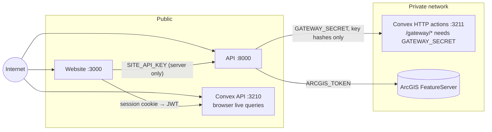

# Architecture

## Components

| Component | Tech | Responsibility | State |
|---|---|---|---|
| `apps/web` | Next.js 16 (App Router), Tailwind, shadcn/ui, MapLibre, TanStack Query | map, developer portal, docs, playground, dashboard; same-origin proxies | none |
| `apps/api` | FastAPI, Pydantic, httpx | public `/v1` API: auth, rate limits, validation, errors, geo services, ArcGIS adapter, routing graph | in-memory caches only |
| `apps/convex` | self-hosted Convex, Convex Auth | accounts, sessions, API keys, rate-limit counters, usage | Convex database |
| ArcGIS FeatureServer | yours | places, addresses, roads | yours |

## Trust boundaries



- Browsers never see `SITE_API_KEY`, `GATEWAY_SECRET`, `API_KEY_PEPPER` or any ArcGIS URL.
- Convex functions that the browser can call require a signed-in developer. The gateway functions are `internal` and reachable only through the secret-protected `/gateway/*` HTTP actions.

## Key flows

### Developer sign-in (Convex Auth)

1. The login form calls `signIn("password", …)`. The request goes to `POST /api/auth` on the website.
2. `proxy.ts` (Convex Auth's Next.js integration) does the following:
   - rejects cross-origin calls;
   - forwards the call to the `auth:signIn` action;
   - sets the refresh token in an httpOnly cookie;
   - returns a short-lived access JWT.

   It also normalizes "unknown email" and "wrong password" into one error.
3. Dashboard pages check the session on the server (`isAuthenticatedNextjs`). The client uses the JWT for live Convex queries and refreshes it through `/api/auth`.

### API key lifecycle

- **Create or regenerate.** A Convex action generates `geo_live_` or `geo_test_` plus 32 base62 characters with `crypto.getRandomValues`. It stores `HMAC-SHA256(API_KEY_PEPPER, key)` and the display prefix, and returns the secret once. Regenerate swaps the hash in place.
- **Revoke.** Sets `revokedAt`. The next request with that key gets `403 API_KEY_REVOKED`.

### Authenticating a `/v1` request

1. The gateway parses `Authorization: Bearer …` and checks the format. Malformed keys get `401` without touching Convex.
2. It hashes the key with the pepper and calls `/gateway/authorize` with the hash.
3. Convex runs one mutation that:
   - looks up the key by hash;
   - checks revocation and expiry;
   - increments the fixed one-minute window (per key, or per visitor IP for the site key);
   - returns the principal and the limit state.
4. The gateway sets `X-RateLimit-*` on every `/v1` response, errors included. It returns `429` with `Retry-After` when the limit is exceeded, and `503` if Convex is unreachable.

### Usage tracking

The metering middleware queues `{key, user, endpoint, method, status, response time, timestamp}` for every authenticated `/v1` request. A background task sends batches to `/gateway/usage` every second. Convex inserts `apiRequests` rows, updates `usageDaily` rollups and sets `lastUsedAt` in the same mutation.

If Convex is briefly down, the gateway keeps up to 50k pending records and retries. Dashboard queries read only the rollups plus a paginated recent-requests list, and they update live.

### Playground

1. The docs page asks `/api/playground/keys` for the developer's active keys. This is a Next route that uses the session cookie.
2. It then asks `POST /api/playground/token` for a 15-minute `geo_pt_…` token bound to the chosen key. That route checks the request's origin.
3. The browser calls the public API directly with that token, which the gateway authorizes like the key itself (same limits, same usage attribution).
4. The real secret is never needed and never exposed.

### Public map

The map calls `/api/v1/*` on the website. The Next route forwards to the API with `SITE_API_KEY` and `X-Client-IP`. The API applies a per-visitor limit, so one visitor cannot exhaust the shared key.

## Errors

Every non-2xx response has the same envelope:

```json
{ "error": { "code": "INVALID_REQUEST", "message": "…", "details": { "field": "lat" } } }
```

Codes: `INVALID_REQUEST` (400), `INVALID_API_KEY` (401), `API_KEY_REVOKED` (403), `NOT_FOUND` (404), `REQUEST_TIMEOUT` (408), `RATE_LIMIT_EXCEEDED` (429), `INTERNAL_ERROR` (500), `UPSTREAM_ERROR` (502), `SERVICE_UNAVAILABLE` (503).

## Observability

- **Logs.** The API writes one JSON line per request to stdout: `timestamp`, `level`, `request_id`, `method`, `endpoint`, `status`, `response_time_ms`, `api_key_id`. Secrets are redacted; query strings are never logged.
- **Request IDs.** `X-Request-ID` is echoed back, or generated when absent.
- **Health.** `GET /health` is liveness. `GET /health/ready` checks Convex (503 when down) and each ArcGIS layer (reported as degraded).

## Versioning

`/v1` receives only additive, backwards-compatible changes. Breaking changes go to `/v2`, which will run alongside `/v1` during a deprecation period. The OpenAPI document in `packages/types/openapi.json` is the contract. A test fails when the code and the committed schema diverge.
